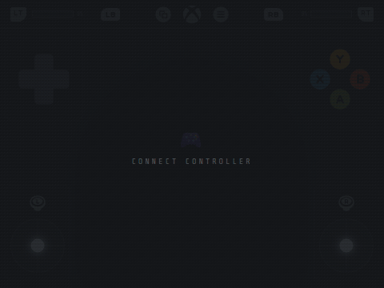
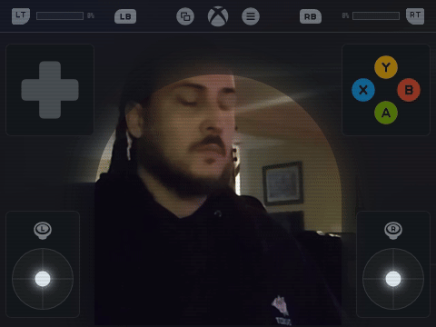
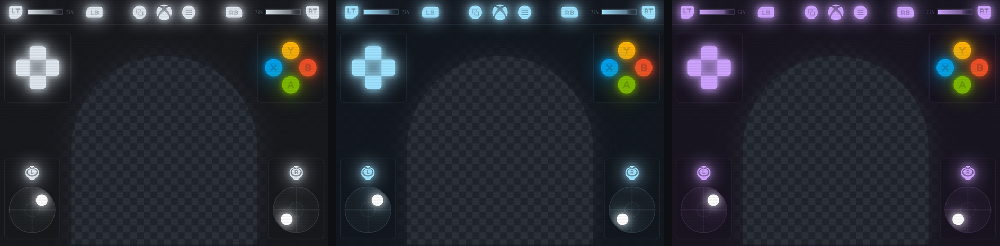
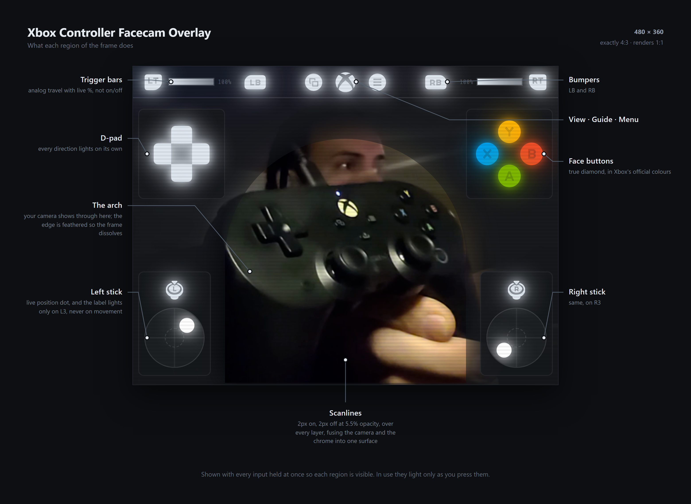

<div align="center">

# Xbox Controller Facecam Overlay

**A webcam frame with live controller input built in.**
Your face in a softly vignetted arch, your inputs lighting up in the corners,
a fine CRT scanline tying it together.

[](LICENSE)
[](../../releases/latest)
[](#)
[](controller-overlay.html)



</div>

---

## On camera

The arch is transparent, so your webcam sits behind it:



---

## Colorways

Three ready-made files. Identical layout, different accent. Face buttons always keep
Xbox's official colours so they stay readable at a glance.

Shown on a transparency checker: everything you can see through is genuinely transparent,
including the arch and its feathered edge, so it composites straight onto your camera.



| File | Accent | |
|---|---|---|
| [`controller-overlay.html`](controller-overlay.html) | `#dfe7ef` | **Slate**, neutral greys and whites, sits over any scene ([full size](colorway-slate.png)) |
| [`controller-overlay-ice.html`](controller-overlay-ice.html) | `#9fe3ff` | **Ice Blue**, cold and cyan-leaning ([full size](colorway-ice.png)) |
| [`controller-overlay-purple.html`](controller-overlay-purple.html) | `#cea3ff` | **Purple** ([full size](colorway-purple.png)) |

Rolling your own is one line: change `--neon` at the top of any of them.

---

## Breakdown



This is **not** a bare input display you park in the corner of gameplay. It's a facecam
frame, sized 4:3 to match a webcam, that happens to show every button you press.

| | |
|---|---|
| **Face buttons** | The real controller diamond (Y north, X west, B east, A south) in Xbox's official colours, each lighting with its own coloured glow. |
| **D-pad** | Kenney's real cross shape, every direction lighting independently. |
| **Analog sticks** | A live position dot tracking the stick in real time. Clicking (L3/R3) swaps the label to the *press* glyph and lights it. Movement never lights, so a click is unmistakable. |
| **Triggers** | The LT/RT glyph lights fully the moment you touch the trigger, while the bar and its glow scale with how far you pull. State and travel, read separately. |
| **Bumpers, View, Guide, Menu** | Proper glyphs, not text labels. |

---

## Install

1. Download one of the three colorway files above
2. Add your **webcam** source at a **4:3** resolution: 1280x960, 640x480, anything 4:3
3. **Sources, +, Browser**. Tick **Local file**, point it at the download,
   set **Width `480`**, **Height `360`**
4. Drag the browser source **above** the camera in the Sources list
5. Give both the **same 480x360 rectangle** on canvas

The camera fills that rect exactly with no letterboxing, because 480x360 is 4:3.

> **Press a controller button once after it loads.** Browsers only expose a gamepad after
> it sends input. If it sits on *connect controller*, press a button, or right-click the
> source and hit **Refresh**.

> **Leave the source transform at scale 1.0.** The layout is fixed at 480x360 in CSS, so it
> renders 1:1 and stays crisp. Scaling the source resamples it and softens the glyphs. If
> you want it larger, scale the camera and overlay together as a group.

---

## Design notes

### The arch

The centre is cut out of a near-opaque panel as a **dome**: straight sides 272px apart
rising to a shoulder, then a true semicircle of radius 136 peaking near the top, built from
a cubic-bezier approximation (k = 0.5523) so the curve is smooth over the apex with no kink.

The cutout is masked **twice from the same path**: once blurred (Gaussian, sigma 18) to
feather the edge, once solid to pin the middle fully transparent. That yields a sharp centre
with a soft vignette falling away into the surrounding dark, so the rectangular edges of
your camera frame dissolve instead of ending in a visible box.

In practice it crops a wide webcam to head-and-shoulders without masking anything in OBS.

### The scanlines

A 4px repeating gradient across every layer: 2px clear, 2px black at **5.5% opacity**.
Deliberately almost subliminal: enough to fuse the camera and the overlay chrome into a
single surface so the UI doesn't look pasted over a video, nowhere near enough to read as a
"CRT filter" or cost you detail.

---

## Configuration

Colours are CSS custom properties at the top of the file:

```css
:root {
  --neon:  #dfe7ef;              /* chrome: d-pad, sticks, bumpers, triggers */
  --dark:  rgba(22,24,28, 0.93); /* top strip */
  --panel: rgba(22,24,28, 0.82); /* corner control pods */
}
```

`--neon` drives everything that isn't a face button. The face buttons keep Xbox's official
colours (`#7DB700` A, `#EF4E29` B, `#009FEB` X, `#FEB504` Y) so they stay readable at a
glance. Edit the `k-face-*` symbols to theme them instead.

| To change | Edit |
|---|---|
| Arch size / shape | the two identical `path` values in `#arch-mask` |
| Vignette softness | `stdDeviation` on the `#taper` filter |
| Scanline strength | the `0.055` alpha in `#overlay::after` |
| Scanline spacing | the `2px` / `4px` stops in that same gradient |
| Trigger glow | the `--on` and `--lvl` multipliers in `.trig-label` and `.trig-fill` |
| Remove scanlines | delete the `#overlay::after` block |
| Remove the webfont | delete the `@import` and the `--font` value |

---

## Credits

Input prompt artwork by **[Kenney](https://kenney.nl)**, released under
[CC0 1.0](https://creativecommons.org/publicdomain/zero/1.0/) (public domain). The SVG paths
are inlined directly into the HTML, so the overlay fetches no artwork at runtime. Kenney's
asset packs are worth your time, go look at them.

The only network request the overlay makes is a single Google Fonts webfont used for the
trigger percentages; delete the `@import` to drop it and run fully offline.

---

## Support

If this saved you some time, tips are genuinely appreciated.

<div align="center">

### [streamelements.com/akilluminati47/tip](https://streamelements.com/akilluminati47/tip)

</div>

---

## License

[MIT](LICENSE) for the code. Kenney's artwork is CC0, not MIT.
